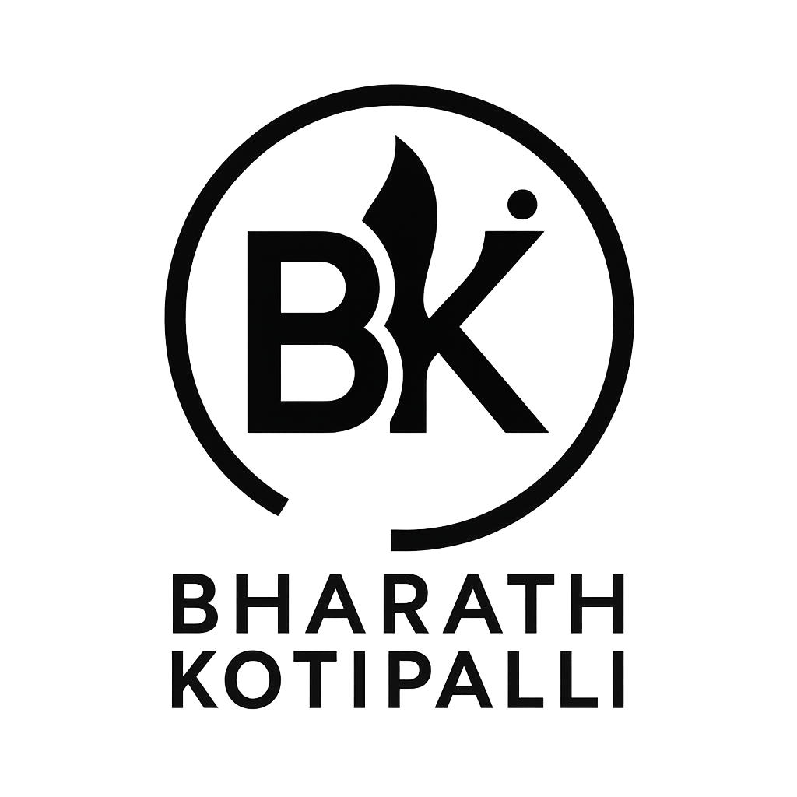

OneClick CP - Competitive Programming Starter Kit

Welcome to OneClick CP, your all-in-one VS Code extension to kickstart and manage your Competitive Programming (CP) sessions with just a click!

⸻

📦 Features

1. 🚀 Reset Files

Quickly reset your main.cpp, input.txt, and output.txt based on the currently selected template. Templates include:
	•	default
	•	Fast_IO
	•	Debug_Template
	•	CP_Template
	•	🔧 Custom templates

2. 📤 Export Solution

Save your current code and input/output files to a Solutions/ folder with a custom name you choose.

3. 🔁 Export + Reset

Combine both reset and export in a single action to move to your next problem.

4. 💾 Create Custom Templates

Save your currently open main.cpp, input.txt, and/or output.txt as a new reusable template. You control:
	•	Template name
	•	Which files to include

5. 📚 Code Snippets (Editor-Based)

Write faster using our curated snippets library. Snippets are automatically available for:
	•	C++ (cpp_basics, cpp_ds, cpp_algos, cpp_adv_algos)
	•	Java
	•	Python

Use them directly via VS Code’s built-in IntelliSense (start typing the prefix like cpdijk for Dijkstra).

⚠️ Snippets currently work via editor autocomplete and not inside the sidebar UI.

6. 🧠 Coming Soon
	•	Dynamic snippet search & categorization in sidebar
	•	Integration with Codeforces, LeetCode, etc.
	•	Problems dashboard, contest timers, and more!

⸻

🖥️ How to Use
	1.	Open your CP workspace folder.
	2.	Click the OneClick CP icon in the Activity Bar.
	3.	Choose your template from the dropdown.
	4.	Click Reset Files to load your default CP setup.
	5.	Start coding!
	6.	Export your solution once done.

Shortcuts:
	•	Ctrl + Alt + R → Reset Files
	•	Snippets auto-trigger in editor using defined prefixes

⸻

🙌 Support Development

If you love this extension and want to support its development:
	•	[☕ Buy me a coffee](https://coff.ee/bharathkotipalli) 
	•	UPI ID: bharath.kotipalli@pingpay
	•	⭐ [Starring the repository](https://github.com/Batz005/OneClick-CP)
    •
    

⸻

🛠️ Installation
	1.	Clone or download this repo
	2.	Run npm install
	3.	Run npm run compile
	4.	Launch extension via Run & Debug (F5) or package via vsce

⸻

🤝 Contributing

Pull requests, issue reports, and suggestions are always welcome!
	1.	Fork the repository
	2.	Make your changes
	3.	Submit a PR with a clear explanation

Suggest a Snippet

Feel free to contribute to the snippet JSONs inside snippets/ folder or open an issue with your idea.

⸻

👤 Author

Developed by Bharath Kotipalli

“Made with ❤️ to make your CP journey smoother.”

⸻

📃 License

MIT © Bharath Kotipalli